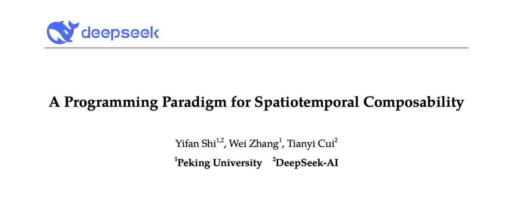

七夕节没事干，于是把cordis的那个论文找出来大致看了一眼，忽然就明白为啥dsh这么强调plugin了，也大概能猜到dsh接下来要做啥了。

{fig-alt="DeepSeek 论文 A Programming Paradigm for Spatiotemporal Composability"}

---

七夕节L带着H来到了530餐厅。这个餐厅以严格的规则闻名，如果一道菜做错了，餐厅会开除所有的厨师，把所有菜都倒掉，重新根据菜谱进行采购，预处理，加工的流程。或许是七夕节实在太忙了，一个厨师放错了菜谱，所有顾客立即被老板赶了出去，厨师也全部解雇，一个浪漫的夜晚就这么没了。

L因为没吃到期待的菜而难过，于是L想，有没有一种办法，在保持高要求的情况下，每次菜品出错只撤走一个厨师，撤掉一道菜，而不影响其他厨师，让餐馆继续运营呢？

在理想状态下，哪个厨师离场，就只要撤掉他做的那些菜就好，其他的菜没有问题，可以不用动，同时，餐厅的营业可以继续。因为这个厨师走了，并不会影响其他厨师做菜，甚至可以在很短的时间内招聘一个更厉害的新厨师填补空缺。

可是问题来了。首先，餐厅很乱，我们不知道这个厨师先后到底做了什么，他具体动了哪些东西，做了几道菜，我们不知道（**时间可组合性**，动作与副作用）；其次，这个厨房很大，配菜很多，我们不知道哪些配菜是这个被赶走的厨师单独需要的，还是别的厨师同样需要的。要是他和做宫保鸡丁的厨师都需要用到花生米，如果我们把他用的花生米一起丢掉了，那宫保鸡丁厨师就只能做没有花生米的宫保鸡丁了（**空间可组合性**，依赖与需求）。

为了解决第一个问题，我们作出以下两条规定：

1. 每次厨师做一个动作，就在一个便签纸上写这个动作相反的动作。比如说这个厨师把酱料从一号柜台放到了三号柜台，那么就在便签纸上写下“把酱料从三号柜台放到一号柜台”
2. 新的便签纸贴在旧的便签纸上（**Accumulator**）。如果这个厨师被赶走了，那就按撕便签纸的顺序，从上往下做便签纸上面写的事情。（**LIFO**，后进先出）

那么我们就可以大概想象以下场景：

> 厨师A把酱料从1柜台拿到了2柜台，在便签纸上写下“从2柜台拿到1柜台”。然后，A又把酱料从2柜台拿到3柜台，在便签纸上写下“从3柜台拿到2柜台”，贴在上一个便签纸的上面。现在如果去看那一叠便签纸，那么第二张会在第一张的上面。于是，当A被赶走之后，我们先执行第二张“从3柜台拿到2柜台”，此时酱料从3到2，然后执行第一张“从2柜台拿到1柜台”，此时酱料回到了1柜台。A厨师就像没有来过一样，酱料回到了A厨师操作之前的位置。

为了解决第二个问题，我们又有以下两条规定：

1. 厨师只有在菜品齐全的情况下做菜（**Activating**）。比如说，宫保鸡丁厨师发现，他要的花生米没有了，于是在他拿到花生米之前，绝对不会做宫保鸡丁。同样的，如果他在处理鸡肉时，发现上面有绿绿的东西，也不可以骗顾客说这是蒜汁，而是立刻停下（**Deactivating**），把锅洗干净，等待新鲜的鸡肉到了之后再重新开始做这道菜。
2. 不同的厨师之间独立工作区域（**Isolation**）。虽然A厨师和B厨师共用一个禽类配菜区，但是一旦A和B拿完肉后，他们俩之间的鸡肉就不能共用了。比如说A要做烤鸭腿，而B要做烤鹅腿，B不可以自己把鹅腿吃了，然后拿A的鸭腿做烤鹅腿。

除此之外，为了提高效率，厨师不需要自己去拿配菜，只需要在看板上明确指出自己需要什么就好了（**Specification & Notification**），会有配菜员帮忙拿。

有了上面这四条规定以后，这个餐馆似乎就拟人了起来，至少不会仅仅因为一道菜错了而解散整个餐馆。

但是，问题还是没有解决完。比如说，配菜区有一锅高汤，A和B都需要，但是A比B做的更快，A会觉得高汤已经用完了，可以直接倒掉。又或者，当菜做到一半时，顾客退单了（现实生活中不可以哦），厨师只知道要做一道菜，不知道当顾客退单时该如何反应，即使被告知退单了，还是硬着头皮做完。那么为了解决以上几个问题，我们又增加了几个规定：
1. 在清除原料之前需要确保没人需要了（**Withdrawal 守卫**）。也就是说，如果A和B都需要高汤，A需要等B也用完高汤之后再倒掉，不能过河拆桥。
2. 炒菜按步骤来，并且随时叫停（**Iteration & Divert**）。比如说，真的有客人非要退菜不可，厨师听到通知后就立刻停下，不需要把菜做完，直接洗锅准备下一道菜。
3. 如果一道菜炒糊了（**Failure**），马上停止，自觉离开，但不要影响其他厨师正常出餐。
4. 无论后厨多么鸡飞狗跳，今天结束时的餐厅，要和平平安安的一天结束后的餐厅一模一样。（**Confluence**）

那么这样子做，除了做错菜不需要直接解散餐厅外，还有什么好处呢？是有的。

比如说某一天，老板在一天的营业时间中招了一个新的厨师C，这个厨师C需要和A共用鸭腿，需要和B共用生菜。如果按照原来的思路，那么这个餐厅又需要立刻解散，至少配菜区需要重新分配菜品，这个新厨师必须得等下一餐再一次进行配菜的时候，才能开始做新菜，餐厅的菜单也需要重新做。但如果按照新的规定，这个新厨师不需要等到下一餐，可以直接开始做菜，配菜员可以直接根据库存把他需要的配菜直接拿给他，库存没有的，就立刻到菜市场买；菜单也不用重新做，只要在原有列表里加一个新菜就好了。

可以发现，L做的这些规定，把一个很抽象的餐厅，变成了我们目前相对更熟悉、更拟人的餐厅。

---

以上就是对论文里面出现的一些名词的形象解释，以及它们之间大致的联系。对于ds的cordis运行时而言，可以理解为，新增plugin不需要重新构建，也不会连累其他plugin。比起openclaw有时候装个skill都能给自己搞死，这种新的范式可以防止整个运行时不会因为某个插件出错，或者新增或删除某个插件而需要重新构建。也就是说，这个88页的论文（数字挺吉利），主要是为了plugin而写，那重点必然就是掌控这些plugin的小妙招了。

其实后面大部分内容都是在证明一些很刁钻但是的确会碰到的一些问题。比如说，A的LIFO可能会和B的LIFO顺序冲突，A回滚之后，很可能会影响B的环境。比如说，B在酱料在2柜台时用了酱料，可是A回滚后酱料只在1柜台呆着，此时就会与B冲突。那么论文中通过证明，只要各组件在操作上满足独立性，对A的操作就会穿透对其他组件的操作，在任意排序下只对A发生改变。比方说，虽然都用酱料，但是A用甜辣酱，B用番茄酱。

还有一个问题就很有意思，还是高汤的例子。如果高汤师傅A对B说，我等你用完高汤再把锅倒干净洗掉。万一B也在等配菜员C洗完锅，配菜员C又在等高汤师傅A空出灶台，那么这三个人就绑定锁死了，谁也不能离开。此时cordis就用两阶段打烊的策略和无环拓扑的结构来解决这个问题。首先，一旦A准备下班，那么A就会先挂一个“马上下班”的牌子，然后写上现在在用的人，并拒绝新的菜品用这个，等到上面有名字的人都用完了，再把高汤倒掉。其次，食材依赖链条不能有环，也就是说，做鲍鱼先有高汤，那做高汤就不能要求先有鲍鱼。

最后，关于梁子的目的。虽然说在论文很前面的motivation部分用VSC来阐述动机，并且我觉得他提到的VSC的问题并不会困扰用户，但是最后的落脚点是在一个关键词，也就是“self-evolving”上面。也就是说，deepseek harness与其说是给人的一个工具，不妨说是给AI厨师们和老板们规定了一些可以让它们自行发展的规则，他们可以随时并且自行给餐厅新增员工（plugin），作出新的菜品，而不会影响餐厅的正常运营。

DSH目前只有Web端，我猜测或许以后真的人类只需要看着一个看板，把需要的菜写上去，而不用自己去一点一点指导AI应该做什么。
